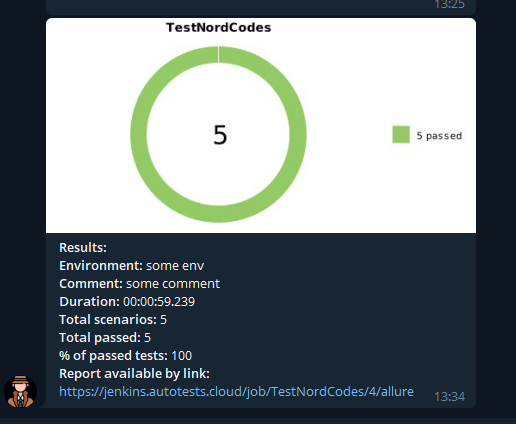

## Автоматизированное тестирование сайта NORD.CODES
____
### :large_blue_circle: Содержание
:wrench: Покрытый функционал

:wrench: Технологический стек

:wrench: Запуск тестов из терминала

:wrench: Удаленный запуск тестов

:wrench: Сборка в Jenkins

:wrench: Отчет о результатах тестирования в Allure Report

:wrench: Уведомления в Telegram с использованием бота

:wrench: Пример запуска теста в Selenoid
____
### Функционал
#### UI
:white_check_mark: Проверка открытия ссылки

:white_check_mark: Открытие страницы Контакты

:white_check_mark: Заполнение формы

:white_check_mark: Проверка наличия вакансий

:white_check_mark: Проверка информации о компании
____    
### Технологический стек

<p align="center">


</p>

____
### Запуск тестов из терминала
#### Локальный запуск тестов

```
gradle clean test
```

#### Удаленный запуск тестов
```
clean
test
-Dbrowser=${BROWSER}
-Dsize=${SIZE}
```
____

### :o: Главная страница сборки в Jenkins
____

### :o: Отчет о результатах тестирования в Allure Report
____
#### :white_check_mark: Главная страница Allure-отчета

____
#### :white_check_mark: Страница с тестами

____
### :o: Уведомления в Telegram с использованием бота 
____
После завершения сборки бот, созданный в `Telegram`, автоматически обрабатывает и отправляет сообщение с отчетом.

____
### :o: Пример запуска теста в Selenoid
____
К каждому тесту в отчете прилагается видео. Одно из таких видео представлено ниже.
